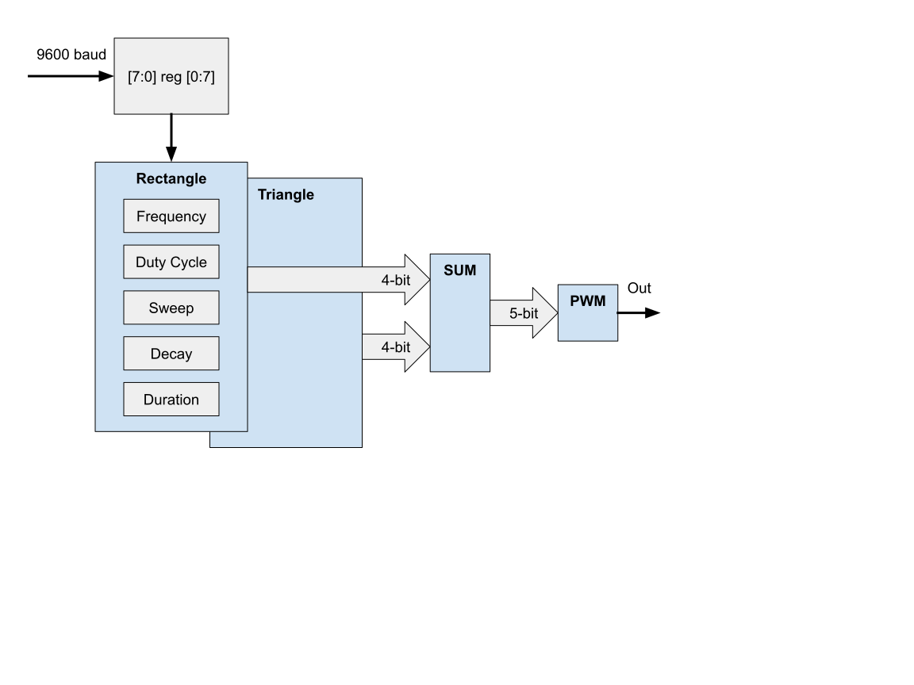

 

# The ChipTune Project

This project is an audio device that replicates the square-wave sound generators of vintage video games.

## TinyTapeout 4 Configuration

Devices from the eFabless Multi-Project Wafer (MPW) shuttle are delivered in two package options, each with 64 pins. TinyTapeout 4 will be packaged in the QFN variant, mounted on a daughterboard for breakout.

### MPRJ_IO Pin Assignments
| Signal      | Name                          | Dir | WCSP | QFN | PCB   |
| ----------- | ----------------------------- |---- |----- |---- |------ |
| mprj_io[0]  | JTAG                          | In  | D7   | 31  | J3.14 |
| mprj_io[1]  | SDO                           | Out | E9   | 32  | J3.13 |
| mprj_io[2]  | SDI                           | In  | F9   | 33  | J3.12 |
| mprj_io[3]  | CSB                           | In  | E8   | 34  | J3.11 |
| mprj_io[4]  | SCK                           | In  | F8   | 35  | J3.10 |
| mprj_io[5]  | SER_RX                        | In  | E7   | 36  | J3.9  |
| mprj_io[6]  | SER_TX                        | Out | F7   | 37  | J3.8  |
| mprj_io[7]  | IRQ                           | In  | E5   | 41  | J3.7  |
| mprj_io[8]  | DRIVER_SEL[0]                 | In  | F5   | 42  | J3.6  |
| mprj_io[9]  | DRIVER_SEL[1]                 | In  | E4   | 43  | J3.5  |
| mprj_io[10] | SLOW_CLK                      | Out | F4   | 44  | J3.4  |
| mprj_io[11] | SET_CLK_DIV                   | In  | E3   | 45  | J3.3  |
| mprj_io[12] | ACTIVE_SELECT[0]              | In  | F3   | 46  | J3.2  |
| mprj_io[13] | ACTIVE_SELECT[1]              | In  | D3   | 48  | J3.1  |
| mprj_io[14] | ACTIVE_SELECT[2]              | In  | E2   | 50  | J2.14 |
| mprj_io[15] | ACTIVE_SELECT[3]              | In  | F1   | 51  | J2.13 |
| mprj_io[16] | ACTIVE_SELECT[4]              | In  | E1   | 53  | J2.12 |
| mprj_io[17] | ACTIVE_SELECT[5]              | In  | D2   | 54  | J2.11 |
| mprj_io[18] | ACTIVE_SELECT[6]              | In  | D1   | 55  | J2.10 |
| mprj_io[19] | ACTIVE_SELECT[7]              | In  | C10  | 57  | J2.9  |
| mprj_io[20] | ACTIVE_SELECT[8]              | In  | C2   | 58  | J2.8  |
| mprj_io[21] | IO_IN[0] / EXT_SCAN_CLK_OUT   | In  | B1   | 59  | J2.7  |
| mprj_io[22] | IO_IN[1] / EXT_SCAN_DATA_OUT  | In  | B2   | 60  | J2.6  |
| mprj_io[23] | IO_IN[2] / EXT_SCAN_SELECT    | In  | A1   | 61  | J2.5  |
| mprj_io[24] | IO_IN[3] / EXT_SCAN_LATCH_EN  | In  | C3   | 62  | J2.4  |
| mprj_io[25] | IO_IN[4]                      | In  | A3   |  2  | J2.3  |
| mprj_io[26] | IO_IN[5]                      | In  | B4   |  3  | J2.2  |
| mprj_io[27] | IO_IN[6]                      | In  | A4   |  4  | J2.1  |
| mprj_io[28] | IO_IN[7]                      | In  | B5   |  5  | J1.14 |
| mprj_io[29] | IO_OUT[0] / EXT_SCAN_DATA_IN  | Out | A5   |  6  | J1.13 |
| mprj_io[30] | IO_OUT[1] / EXT_SCAN_DATA_IN  | Out | B6   |  7  | J1.12 |
| mprj_io[31] | IO_OUT[2]                     | Out | A6   |  8  | J1.11 |
| mprj_io[32] | IO_OUT[3]                     | Out | A7   | 11  | J1.10 |
| mprj_io[33] | IO_OUT[4]                     | Out | C8   | 12  | J1.9  |
| mprj_io[34] | IO_OUT[5]                     | Out | B8   | 13  | J1.4  |
| mprj_io[35] | IO_OUT[6]                     | Out | A8   | 14  | J1.3  |
| mprj_io[36] | IO_OUT[7]                     | Out | B9   | 15  | J1.2  |
| mprj_io[37] | READY                         | Out | A9   | 16  | J1.1  |

## ChipTune Operation

The audio portion of the project consists of two rectangular pulse generators. Each module is controlled by four 8-bit registers. Configurable parameters are the frequency, duty cycle, sweep, decay, and note duration.

The frequency range of the project is limited by the legacy scanchain, but mid-range frequencies are acceptable. Additional triangle and noise modules will be added in future work when more bandwidth is available.

### ChipTune Pin Assignments
| Signal     | Name     | Signal     | Name     |
| ---------- | ---------| ---------- | ---------|
| clk        | 12 MHz   | rst_n      | RESET_N  |
| ena        | SPARE    | uio_oe[7]  | SPARE    |
| ui_in[0]   | RX       | uo_out[0]  | PWM      |
| ui_in[1]   | SPARE    | uo_out[1]  | BLINK    |
| ui_in[2]   | SPARE    | uo_out[2]  | LINK     |
| ui_in[3]   | SPARE    | uo_out[3]  | TX       |
| ui_in[4]   | SPARE    | uo_out[4]  | SPARE    |
| ui_in[5]   | SPARE    | uo_out[5]  | SPARE    |
| ui_in[6]   | SPARE    | uo_out[6]  | SPARE    |
| ui_in[7]   | SPARE    | uo_out[7]  | SPARE    |
| uio_in[7]  | SPARE    | uio_out[7] | SPARE    |

## Design For Test Considerations

Communication with the computer is at {9600,n,8,1}.

## Summary

An external serial port can play music through this TT04 project.
